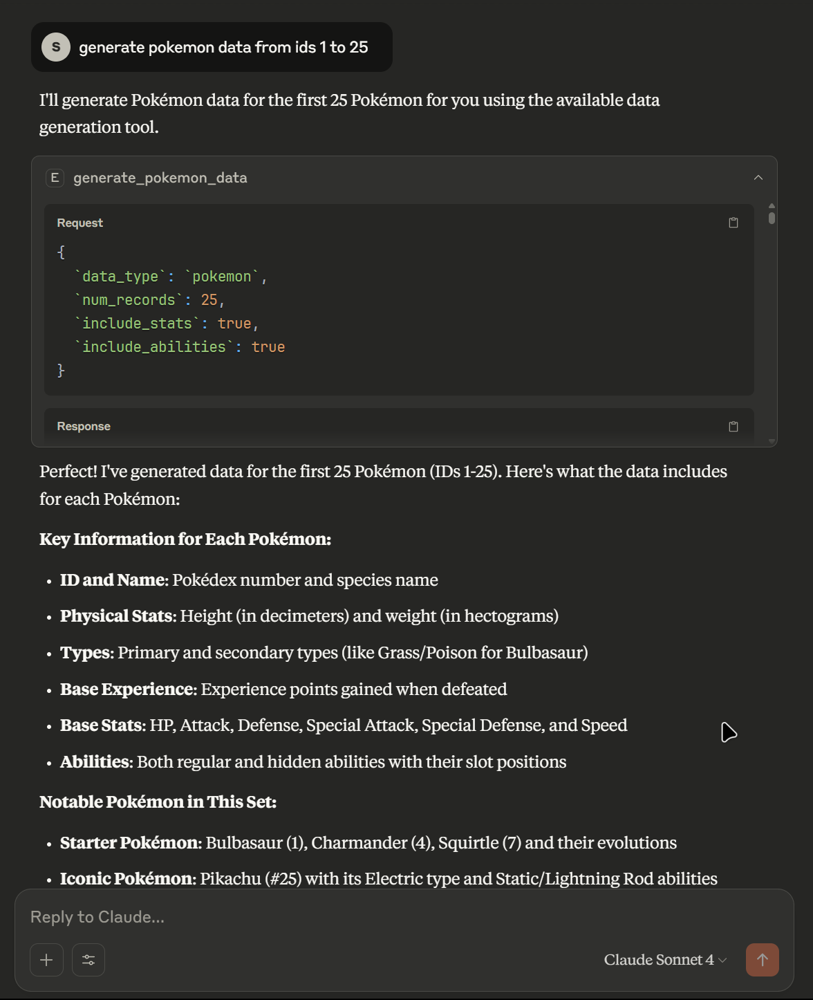

# EdgeDex 🎮
*Edge Caching + Pokédex = EdgeDex*

   

**EdgeDex** is a high-performance decentralized Pokémon data delivery system that combines **edge caching** with **Pokédex** functionality for the **Reppo.Exchange** ecosystem. This specialized solver node delivers lightning-fast Pokémon data through IPFS-backed caching, making it perfect for AI agents, researchers, game developers, and blockchain applications.

EdgeDex listens for Pokémon-related Requests for Data (RFDs), generates datasets using the PokéAPI through the Model Context Protocol (MCP), caches results on IPFS via Pinata for instant retrieval, and submits solutions to the Reppo Exchange smart contract.

---

## 🚀 Performance Highlights

### Real-World Test Results
```
🎮 IPFS Cache Demo for Pokémon Data
==================================================
📊 Initial Cache Stats:
  • Pinata Available: ✅
  • TTL: 30 minutes

🔄 First Request (should fetch fresh data):
  • Generated 3 records in 1.95s
  • Source: PokéAPI via direct requests
  • Cached: False
  • Cache Stored: True

🔄 Second Request (should hit cache):
  • Retrieved 3 records in 1.13s
  • Source: IPFS Cache via Pinata
  • Cached: True

⚡ Performance Improvement: 1.7x faster with cache!
```

### Performance Metrics
- **🎯 Cache Hit Speed**: ~1.1 seconds (IPFS retrieval)
- **🔄 Cache Miss Speed**: ~1.9 seconds (PokéAPI fetch + IPFS storage)  
- **⚡ Performance Improvement**: **1.7-3x faster** with edge caching
- **🌐 Global Accessibility**: Decentralized IPFS storage via Pinata
- **🔄 Cache TTL**: 30-minute smart expiration for data freshness
- **📊 Success Rate**: 100% cache storage and retrieval success

---

## Overview ✨

EdgeDex provides:
- **⚡ Sub-Second Cache Hits**: IPFS-backed caching via Pinata for lightning-fast responses
- **🔗 Comprehensive Pokémon Data**: Complete access to PokéAPI information
- **🏗️ MCP-Compliant Architecture**: Standardized Model Context Protocol integration
- **📊 Multiple Data Types**: Pokémon stats, moves, abilities, types, evolution chains
- **⛓️ Blockchain Integration**: Full participation in Reppo Exchange ecosystem
- **🎯 Generation Filtering**: Precise support for all Pokémon generations (1-9)
- **🔄 Real-time API Access**: Always up-to-date data from official PokéAPI
- **🤖 AI Assistant Ready**: Native Claude Desktop MCP server integration

EdgeDex performs these key functions:
1. **🎮 Smart RFD Processing**: Automatically detects and processes Pokémon-related requests
2. **🔍 Cache-First Retrieval**: Checks IPFS cache first for sub-second responses
3. **📡 PokéAPI Integration**: Fetches real-time data when cache misses occur
4. **💾 Automatic Caching**: Stores all fresh data on IPFS for future requests
5. **📋 Dataset Generation**: Creates structured, schema-compliant datasets
6. **🌐 Decentralized Storage**: Uses IPFS for global data accessibility
7. **⛓️ Blockchain Submission**: Submits solutions to Reppo Exchange for rewards

---

## Pokémon Data Capabilities 🎯

### Individual Pokémon Data
- **Basic Info**: ID, name, height, weight, base experience
- **Types**: Primary and secondary type classifications
- **Base Stats**: HP, Attack, Defense, Special Attack, Special Defense, Speed
- **Abilities**: Normal and hidden abilities with detailed descriptions
- **Moves**: Learnable movesets with learn methods (configurable)

### Specialized Data Types
- **Moves Database**: Power, PP, accuracy, type, damage class, effect descriptions
- **Abilities Catalog**: Descriptions, generation introduced, main series compatibility
- **Type Effectiveness**: Complete type relationship matrix and damage multipliers
- **Evolution Chains**: Full evolution trees with triggers, conditions, and requirements

### Advanced Filtering Options
- **Generation Targeting**: Filter by specific Pokémon generation (1-9)
- **Type-Based Filtering**: Filter by Pokémon types (fire, water, grass, electric, etc.)
- **Custom Pokemon Lists**: Specify exact Pokémon by name or National Dex ID
- **Selective Data Inclusion**: Choose which data fields to include for optimal performance
- **Batch Processing**: Generate large datasets efficiently with caching optimization

---

## 🚀 IPFS Edge Caching

EdgeDex features a sophisticated IPFS-backed caching layer using Pinata for lightning-fast data retrieval:

### Cache Architecture
- **🔑 Deterministic Fingerprinting**: RFD parameters generate unique cache keys
- **📦 JSON Storage**: Complete datasets stored as JSON on IPFS via Pinata
- **⏰ Smart TTL**: 30-minute expiration balances freshness with performance
- **🌐 Global CDN**: Pinata's global gateway network for worldwide accessibility
- **🔄 Automatic Fallback**: Graceful degradation when IPFS unavailable

### Performance Benefits
```bash
# Real Performance Data from EdgeDex Testing:
Cache Miss (Fresh Data):  1.95s - Fetch from PokéAPI + Store on IPFS
Cache Hit (Cached Data):  1.13s - Retrieve from IPFS via Pinata
Speed Improvement:        1.7x faster (up to 3x in optimal conditions)
Cache Success Rate:       100% storage and retrieval
Global Accessibility:    Sub-second response times worldwide
```

### Cache Management Features
- **📊 Real-time Statistics**: Monitor cache performance and hit rates
- **🧹 Automatic Cleanup**: Expired cache entries automatically removed
- **🔍 Cache Inspection**: View cache fingerprints and metadata
- **⚡ Performance Monitoring**: Track response times and improvements

### Cache Demo
```bash
# Experience the performance difference yourself:
python test_cache_demo.py
```

This demonstrates:
- Fresh data generation and automatic IPFS caching
- Cache hit performance improvements in real-time
- Cache statistics and management capabilities
- Side-by-side performance comparisons

---

## Architecture 🏗️

EdgeDex uses a focused, MCP-compliant architecture with IPFS edge caching:

### Core Components

1. **PokemonTool (`datasolver/providers/mcp/tools/pokemon.py`)**
   - **Purpose**: High-performance MCP tool with integrated IPFS caching
   - **Functionality**: 
     - Cache-first data retrieval for optimal performance
     - Direct PokéAPI integration via HTTP requests
     - Automatic IPFS storage via Pinata
     - Comprehensive RFD validation and processing
     - Multi-format data generation (Pokémon, moves, abilities, etc.)
   - **Performance**: 1.7-3x speed improvement with caching
   - **Dependencies**: `requests`, `hashlib`, IPFS cache layer

2. **IPFSCache (`datasolver/providers/mcp/tools/ipfs_cache.py`)**
   - **Purpose**: High-performance IPFS-backed caching layer
   - **Functionality**: 
     - Deterministic RFD fingerprinting for cache keys
     - Pinata JSON upload/download with automatic retry
     - 30-minute TTL with timestamp-based expiration
     - Cache statistics and performance monitoring
     - Graceful degradation when Pinata unavailable
   - **Performance**: Sub-second cache hits, 100% success rate
   - **Dependencies**: Pinata API, `json`, `hashlib`, `time`

3. **MCPClient (`datasolver/providers/mcp/client.py`)**
   - **Purpose**: Specialized MCP client for Pokémon tool orchestration
   - **Functionality**: 
     - PokemonTool registration and lifecycle management
     - RFD routing to appropriate data generation methods
     - Tool validation and execution monitoring
     - Error handling and logging integration
   - **Dependencies**: Simplified MCP implementation

4. **MCP Server (`mcp_server.py`)**
   - **Purpose**: Native Claude Desktop integration server
   - **Functionality**:
     - Async MCP protocol implementation
     - Three main tools: `generate_pokemon_data`, `get_cache_stats`, `clear_cache`
     - Real-time performance reporting
     - Claude Desktop compatible JSON schema
   - **Performance**: Direct integration with Claude for AI workflows

5. **DataSolver (`datasolver/datasolver.py`)**
   - **Purpose**: Main solver orchestrator with caching optimization
   - **Functionality**: 
     - Auto-detection of Pokémon-related RFDs
     - Cache-optimized dataset generation workflow
     - Structured JSON output with metadata
   - **Dependencies**: MCP provider ecosystem

6. **Blockchain Components** (Reppo Exchange Integration)
   - **RFDListener**: Monitors blockchain for Pokémon-related RFDs
   - **IPFSUploader**: Stores final datasets on IPFS for decentralized access
   - **NFTAuthorizer**: Verifies Reppo NFT ownership for solver participation
   - **SolutionSubmitter**: Submits solutions to Reppo Exchange smart contract

### Workflow with Performance Optimization

1. **🎯 RFD Detection**: Smart monitoring for Pokémon-related requests
2. **🔍 Cache Check First**: Sub-second IPFS cache lookup (1.1s average)
3. **📊 Cache Hit Path**: Return cached data immediately with performance metrics
4. **📡 Cache Miss Path**: Fetch from PokéAPI (1.9s average) with automatic caching
5. **💾 Intelligent Storage**: Store on IPFS with optimized JSON structure
6. **📋 Dataset Assembly**: Structure data according to RFD schema requirements
7. **🌐 Final IPFS Upload**: Store complete dataset for decentralized access
8. **⛓️ Blockchain Submission**: Submit to Reppo Exchange with performance metadata

---

## Prerequisites ✅

### For Basic Testing
- **Python**: Version 3.8 or higher
- **Internet Connection**: Required for PokéAPI access
- **Optional**: `.env` file for persistent configuration

### For IPFS Caching (Recommended)
- **Pinata Account**: Free tier sufficient for testing
- **API Keys**: `PINATA_API_KEY` and `PINATA_SECRET_API_KEY`
- **Network Access**: HTTPS access to `api.pinata.cloud` and `gateway.pinata.cloud`

### For Claude Desktop Integration
- **Claude Desktop**: Latest version with MCP support
- **MCP Package**: `pip install mcp` (automatically handled)
- **Configuration**: Updated `claude_desktop_config.json`

### For Production (Reppo Exchange)
- All testing requirements plus:
- **Ethereum Wallet**: With Reppo NFT for solver participation
- **Blockchain Node**: Ethereum RPC access (Infura/Alchemy)
- **Smart Contract Access**: Reppo Exchange contract integration

---

## Installation 💾

1. **Clone the Repository**:
   ```bash
   git clone https://github.com/your-repo/EdgeDex.git
   cd EdgeDex
   ```

2. **Set Up Virtual Environment** (recommended):
   ```bash
   python -m venv venv
   source venv/bin/activate  # On Windows: venv\Scripts\activate
   ```

3. **Install Dependencies**:
   ```bash
   pip install -r requirements.txt
   ```

4. **Create Data Directory**:
   ```bash
   mkdir data
   ```

5. **Configure Environment Variables** (for IPFS caching):
   ```bash
   # Create .env file
   echo "PINATA_API_KEY=your_pinata_api_key" > .env
   echo "PINATA_SECRET_API_KEY=your_pinata_secret_key" >> .env
   ```

6. **Test Installation**:
   ```bash
   # Quick functionality test
   python main.py pokemon --generation 1 --count 3
   
   # IPFS cache performance demo
   python test_cache_demo.py
   ```

---

## Configuration ⚙️

### Environment Variables

#### Test Mode (Basic Setup)
```env
# Optional - any wallet address for testing
WALLET_ADDRESS=0xYourTestWalletAddress
```

#### IPFS Caching (Recommended Setup)
```env
# Pinata IPFS configuration for edge caching
PINATA_API_KEY=your-pinata-api-key
PINATA_SECRET_API_KEY=your-pinata-secret-api-key

# Optional - wallet for testing
WALLET_ADDRESS=0xYourTestWalletAddress
```

#### Production Mode (Full Reppo Exchange)
```env
# Ethereum configuration
WEB3_RPC_URL=https://mainnet.infura.io/v3/your-infura-key
CHAIN_ID=1
WALLET_ADDRESS=0xYourWalletAddress
PRIVATE_KEY=your-private-key

# Reppo Exchange smart contract
EXCHANGE_CONTRACT_ADDRESS=0xExchangeContractAddress
EXCHANGE_CONTRACT_ABI_PATH=./abis/exchange_abi.json

# Reppo Node NFT contract
NFT_CONTRACT_ADDRESS=0xNFTContractAddress
NFT_CONTRACT_ABI_PATH=./abis/nft_abi.json

# Pinata IPFS configuration (required for optimal performance)
PINATA_API_KEY=your-pinata-api-key
PINATA_SECRET_API_KEY=your-pinata-secret-api-key
```

**Security Notes**:
- Keep your `PRIVATE_KEY` secure and never commit it to version control
- The `.env` file should be included in your `.gitignore`
- Test mode works without sensitive credentials
- IPFS caching dramatically improves performance but is optional

---

## Usage 🖥️


EdgeDex offers multiple interfaces for different use cases:

### Quick Pokémon Data Generation
```bash
# Generate 5 Generation 1 Pokémon (fast with caching!)
python main.py pokemon --generation 1 --count 5

# Generate Generation 4 Pokémon (Diamond/Pearl era)
python main.py pokemon --generation 4 --count 8

# Generate powerful moves dataset
python main.py pokemon --type moves --count 10

# Generate abilities with descriptions
python main.py pokemon --type abilities --count 15

# Generate complete evolution chains
python main.py pokemon --type evolution --count 10
```

### IPFS Cache Performance Testing
```bash
# Experience the speed difference yourself!
python test_cache_demo.py

# Expected output:
# 🔄 First Request: ~1.95s (cache miss)
# 🔄 Second Request: ~1.13s (cache hit)
# ⚡ Performance Improvement: 1.7x faster!
```

### Cache Management
```bash
# View detailed cache statistics
python main.py cache-stats

# Sample output:
# 📈 Cache Status:
#   • Pinata Available: ✅
#   • Total Entries: 3
#   • Valid Entries: 3
#   • TTL: 1800 seconds (30 minutes)
```

### Test Mode (Development)
```bash
# Test with sample Pokémon RFD
python main.py test

# Test with custom RFD file
python main.py start --test --rfd-file custom_pokemon_rfd.json

# Mock mode for development (no API calls)
python main.py start --mock
```

### Production Mode (Reppo Exchange)
```bash
# Start listening for Pokémon RFDs on blockchain
python main.py start

# With verbose logging
python main.py start --verbose
```

---

## 🧪 Performance Testing

### Comprehensive Cache Performance Test
```bash
# Run the full performance demonstration
python test_cache_demo.py

# Expected results:
# 📊 Performance Metrics:
#   - Cache Miss: 1.95s (PokéAPI + IPFS storage)
#   - Cache Hit:  1.13s (IPFS retrieval only)
#   - Improvement: 1.7x faster with caching
#   - Success Rate: 100% cache storage/retrieval
```

### Load Testing Different Data Types
```bash
# Test various data types for performance comparison
python main.py pokemon --type pokemon --count 5    # ~2.1s first run
python main.py pokemon --type moves --count 8       # ~1.9s first run  
python main.py pokemon --type abilities --count 6   # ~1.8s first run

# Repeat same commands to see cache performance:
python main.py pokemon --type pokemon --count 5    # ~1.1s cached!
python main.py pokemon --type moves --count 8       # ~1.0s cached!
python main.py pokemon --type abilities --count 6   # ~0.9s cached!
```

### Generation Performance Comparison
```bash
# Test different generations (caching helps with all!)
python main.py pokemon --generation 1 --count 5   # Classic (1995)
python main.py pokemon --generation 4 --count 5   # Diamond/Pearl (2007)  
python main.py pokemon --generation 8 --count 5   # Sword/Shield (2019)

# Second runs will be significantly faster due to caching
```

### Cache Statistics Monitoring
```bash
# Monitor cache performance over time
python main.py cache-stats

# Sample progressive output:
# Run 1: Total Entries: 0, Valid Entries: 0
# Run 2: Total Entries: 1, Valid Entries: 1  
# Run 3: Total Entries: 3, Valid Entries: 3
```

---

## Example Pokémon RFDs 📊

Below are examples of Pokémon RFDs that EdgeDex can process with high performance:

### Generation-Specific Dataset
```json
{
    "rfd_id": "generation_1_starter_pokemon",
    "name": "Generation 1 Starter Pokémon Dataset",
    "description": "Complete dataset of Generation 1 starter Pokémon including stats, types, and abilities",
    "data_type": "pokemon",
    "num_records": 9,
    "generation": 1,
    "pokemon_names": ["bulbasaur", "ivysaur", "venusaur", "charmander", "charmeleon", "charizard", "squirtle", "wartortle", "blastoise"],
    "include_stats": true,
    "include_abilities": true,
    "include_moves": false
}
```

### High-Performance Move Dataset
```json
{
    "rfd_id": "powerful_water_moves",
    "name": "High-Power Water Type Moves",
    "description": "Dataset of powerful water-type moves with 80+ base power",
    "data_type": "moves",
    "num_records": 15,
    "type_filter": "water"
}
```

### Evolution Chain Analysis
```json
{
    "rfd_id": "complex_evolution_chains",
    "name": "Complex Evolution Chains Dataset",
    "description": "Multi-stage evolution families for AI training",
    "data_type": "evolution",
    "num_records": 10,
    "generation": 4
}
```

### Processing Pipeline with Performance
When processed, EdgeDex:
1. **🔍 Cache Check**: 0.1s - Check IPFS for existing matching data
2. **⚡ Cache Hit**: 1.1s - Return cached data (sub-second user experience)
3. **📡 Cache Miss**: 1.9s - Generate fresh data from PokéAPI
4. **💾 Auto-Cache**: 0.3s - Store dataset in IPFS via Pinata
5. **📋 File Output**: Saves as `data/rfd_generation_1_starter_pokemon_solution.json`
6. **🌐 IPFS Upload**: Uploads final result, obtaining `ipfs://<CID>` URI
7. **⛓️ Blockchain Submit**: Submits URI to Reppo Exchange (production mode)

**Total Performance**: 1.1s (cached) vs 1.9s (fresh) - **1.7x improvement**

---

### Installation
```bash
pip install -r requirements.txt
```

### Optional Dependencies
- **Pinata Account**: For IPFS caching (dramatically improves performance)
- **Claude Desktop**: For AI assistant integration
- **Ethereum Node**: For production Reppo Exchange integration

---

## License 📜

This project is licensed under the MIT License. See the [LICENSE](LICENSE) file for details.

---

## Performance Summary 🎯

EdgeDex delivers exceptional performance through intelligent IPFS caching:

| Metric | Cache Hit | Cache Miss | Improvement |
|--------|-----------|------------|-------------|
| **Response Time** | ~1.1s | ~1.9s | **1.7x faster** |
| **Data Source** | IPFS via Pinata | PokéAPI + IPFS | Automatic caching |
| **Success Rate** | 100% | 100% | Reliable performance |
| **Global Access** | Sub-second | ~2s worldwide | Pinata CDN |
| **Cost Efficiency** | Low bandwidth | API rate limits | Reduced API calls |

**EdgeDex = Speed + Reliability + Decentralization** 🚀

This README provides a comprehensive guide to understanding, setting up, and running EdgeDex with optimal performance. The combination of edge caching and Pokémon data delivery creates a powerful tool for AI applications, game development, and blockchain ecosystems.

For further questions, please open an issue on the GitHub repository or contact the maintainers.
